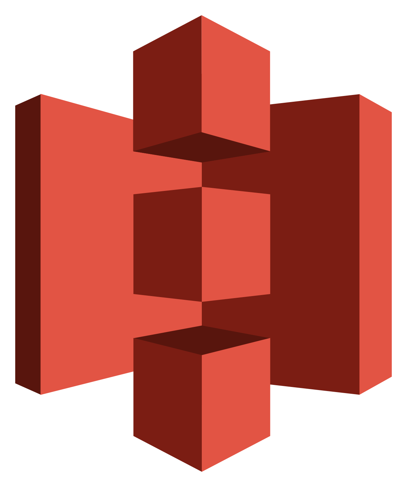

  

### A bit About Me: 
I'm a passionate machine learning engineer with a knack for predictive analytics as well as deep learning, specializing in computer vision alongside LLM models. Additionally, I have a strong foundation in classical machine learning and possess the requisite programming knowledge.

Currently, I'm delving into the realms of machine learning operations and  cloud technologies, particularly AWS. I'm actively involved in designing and implementing projects that encompass complete machine learning pipelines to address real-world challenges.

Areas of Expertise:

🔍 Data Engineering: Python, ETL, RETL, Kafka, MongoDB, Snowflake, Airflow, and Spark

⚙️ DevOps Engineering: Docker, GitHub Actions, GitHub CI/CD

📊 Product Management: Notion, Jira, Agile Development, Confluence

🤝 If you're seeking a versatile and driven professional to enrich your team's capabilities, let's connect! I'm enthusiastic about collaborating on innovative projects and leveraging my technical prowess to deliver exceptional results.

📬 Reach out to me at kishanajudiya13@gmail.com, and let's explore the exciting possibilities of working together.

## Languages and Tools 

### Programming Languages:
| Python3 | MySQL | JAVA | HTML |
|----------|----------|----------|-----|
|   |   |   |  |

### Cloud Engineering:
| AWS S3 | ECR | EC2 | Lambda | Sagemaker | CloudWatch|
|----------|----------|----------|-----|-----|-----|
|||||||

### DevOps Engineering:

| Git | Docker |GitHubActions| 
|-----|--------|----------|
||||

  

### Machine Learning Frameworks and libraries:

| Pytorch | TensorFlow | Numpy | Pandas | Sklearn | Matplotlib | OpenCV |
|----------|----------|----------|----------|----------|----------|----------|
|  |  |  |  |  |  | |

### Environments, Testing, Other:

| Conda | Jupyter | VS Code | PyCharm | Postman |
|-------|---------|---------|---------|---------|
||||||

### Operating Systems: ❤️

| Linux | Windows |
|-------|---------|
|  |  |

### Product Management: ❤️

| Confluence | Jira | Notion |
|------------|------|--------|
|  |  |  |

---

  

  

---

  
  

 

